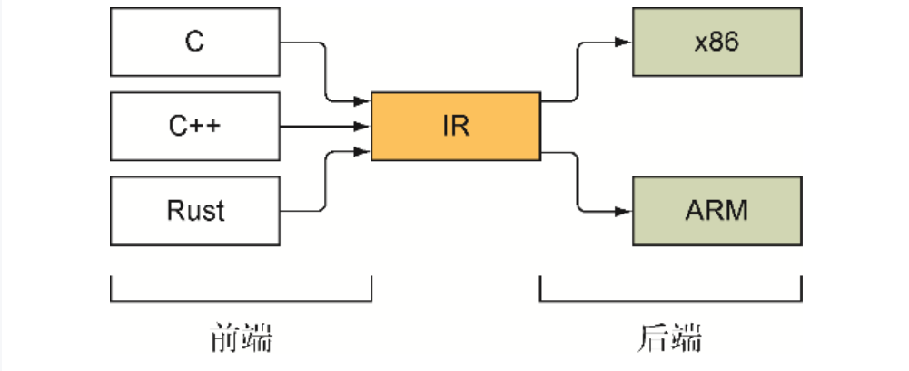
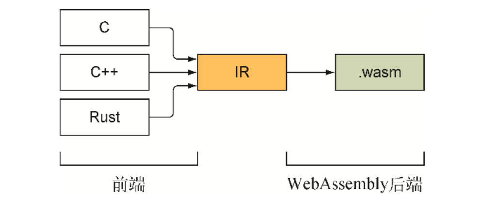
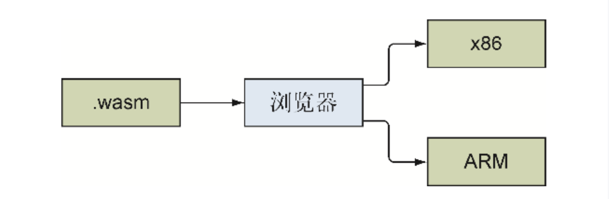
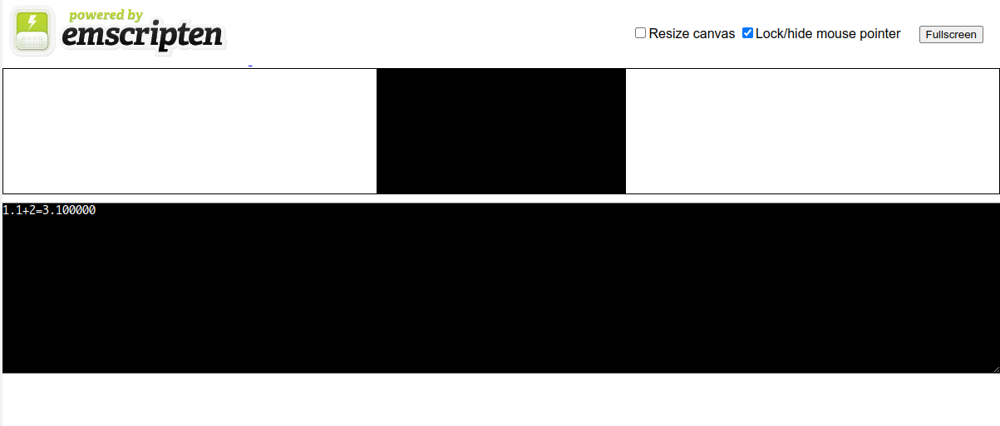
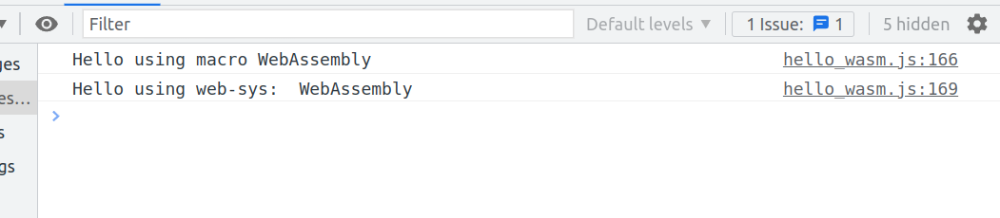

# 使用 Emscripten 工具包

## 编译器工作原理概述

JavaScript 是一种解释型语言，它在需要在运行时读入代码，并将指令即时翻译为机器码，而不需要提前编译代码，这意味着它启动速度快，但是运行慢。
而其它编译型语言（如C++,Rust），就需要先利用编译器将程序代码转换为机器码，然后才能运行，优点是这样有利于优化代码执行，并且一旦编译为机器码，就不需要再次编译。

WebAssembly 需要由其它语言编译为 WebAssembly 二进制，然后在浏览器中转换为机器码运行。

这里有个问题，就是每一类计算机处理器都有它自己的机器码类型，如果将编程语言都直接译为机器码的各个版本，这样做效率会很低，一般的做法是，编译器的前端部分先将代码编译为一种中间表示（Intermediate Representation, IR）.
创建好IR代码后，编译器的后端部分会接收IR代码，进行优化，然后将其转换为所需的机器码。



由于浏览器可以在若干不同的处理器上运行，因此为每个可能的处理器发布一个 WebAssembly 二进制文件会非常繁复。我们可以将IR代码转换为一种专用字节码，并放入 .wasm 的文件中。
.wasm 文件中的字节码还不是机器码， 它只是支持 WebAssembly 的浏览器能够理解的一组虚拟指令。当加载到浏览器中时，浏览器会验证这个文件合法性，然后编译为浏览器所运行设备的机器码。





## Emscripten 作用

他是目前最成熟的，用来将C/C++代码编译为 WebAssembly 字节码的工具包。最初是为了用来转译代码到 asm.js 设计。底层基于 LLVM 编译器， 其好处是是可以向其插入数个前端和后端。

Emscripten 编译器使用 Clang, 后者类似于 C++ 中的 GCC， 可以作为前端编译器将 C/C++ 代码转换为 LVVM IR。然后 Emscripten 会接受 LVVM IR 并转换为一种二进制字节码， 也就是 .wasm 格式。

## WebAssembly 模块

WebAssembly 二进制文件和浏览器中的已编译对象都被称为模块。虽然可以创建一个空模块，但没什么鸟用。模块的函数可以是内建的，也可以从其他模块的导出部分导入，还可以从 JavaScript 导入。

WebAssembly 模块有几个段， 这些段是 Emscripten 根据 C/C++ 代码生成。在底层实现中，段从一个段ID开始，之后是这一段的大小，然后才是内容本身。所有这些段都是可选的，因此可以存在空模块。

起始段（Start(ID=8)）指向本模块内部（非导入）函数的索引值，这个函数在模块能够被 JavaScript 调用前会被自动调用。如果 C/C++ 代码包含 main 函数，则 Emscripten 会把它设置为模块的起始函数。

WebAssembly 模块以 ArrayBuffer 的形式使用从宿主获得内存，这个 buffer 相当于 C/C++ 的对，但每次访问这段内存， WebAssembly 框架都会验证内存访问是否会越界。

WebAssembly 只支持 4 种数据类型：i32, i64, f32, f64, 布尔值用 i32 表示，0 相当于 false, 非 0 值为 true。主机环境设置的所有其他值需要在模块的线性内存内表示。


WebAssembly 模块优势：

1. 被设计为编译目标：未来对它的改进不会影响 JavaScript
2. 可移植性： 可以用在浏览器之外，比如 Node.JavaScript
3. 二进制格式：格式更紧凑，可以被快速传递和下载
4. 单轮验证：文件结构组织支持单轮验证，加快启动过程
5. 流式编译：可以在下载文件同时进行编译，下载后可以立即使用
6. 速度稳定：WebAssembly 字节码可以直接编译为机器码，不需要多次检测，第1次调用和之后调用速度一样快
7. 优化：因为是提前编译的，代码可以在浏览器运行前提前优化
8. 性能：和本地代码几乎一样快，但是WebAssembly会执行一些检查确保代码行为正常，因此和本地代码相比，会有微小的性能下降。

什么时候不适合用 WebAssembly 模块：

1. 如果逻辑非常简单，建立编译器工具链和编写另一种语言可能不合算；
2. 不能直接访问DOM和任何Web API。

## Emscripten 输出选项

根据目标的不同， Emscripten 可以分三种方式创建模块：

1. WebAssembly 模块、JavaScript plumbing 文件， HTML 模板
2. WebAssembly 模块、JavaScript plumbing 文件
3. WebAssembly 模块
    可以在运行时动态链接更多模块

JavaScript plumbing 文件：

Emscripten 生成的 JavaScript 文件，这个文件会自动下载 WebAssembly 文件并在浏览器中将其编译和实例化。

## 实践

### 准备工作

下载和安装 Emscripten: 参考 [官方文档](https://emscripten.org/docs/getting_started/downloads.html)

我使用的是 docker 镜像安装方式， 镜像地址： <https://hub.docker.com/r/emscripten/emsdk>

```bash
docker pull emscripten/emsdk
```

编译命令如下：

```bash
docker run --rm -v $(pwd):/src -u $(id -u):$(id -g) \
  emscripten/emsdk emcc helloworld.cpp -o helloworld.js
```

每次编译都要写这么长的命令有点麻烦， 可以在 `.bashrc` 文件添加别名简化一下：

```bash
alias emcc="docker run --rm -v $(pwd):/src -u $(id -u):$(id -g) emscripten/emsdk emcc"
```

这样编译命令就变成

```bash
emcc helloworld.cpp -o helloworld.html
```

### 使用 Emscripten 编译 C/C++ 

准备一个简单的C代码（add.c）：

```c
#include <stdio.h>
double add(double a, int b) {
    return a + b;
}

int main() {
    printf("1.1+2=%f\n", add(1.1, 2));
}
```

可以编译成 HTML、JavaScript 和 Wasm 文件：

```bash
emcc add.c -o add.html
```

完后开启web服务器查看这个 add.html, 效果如图：



可以在控制台看到输出 `1.1+2=3.100000`

如果不要生成 html 模板， 可以这么执行：

```bash
emcc add.c -o add.js
```

如果是只要 wasm, 可以这样：

```bash
emcc add.c -o add.wasm
```

### 编译 Rust 到 Wasm

这里假设你的环境已经正确安装配置好Rust编译环境。

要将 Rust 编译为 WebAssembly 二进制文件，需要先安装一个附加工具，安装很简单：

```bash
cargo install wasm-pack
```

创建一个 rust 工程： 

```bash
cargo new --lib hello-wasm
```

修改 Cargo.toml :

```toml
[lib]
crate-type = ["cdylib"]

[dependencies]
wasm-bindgen = "0.2.80"

[dependencies.web-sys]
version = "0.3"
features = [
    "console"
]
```

修改 lib.rs:

```rust
use wasm_bindgen::prelude::*;

#[wasm_bindgen]
extern  {
    #[wasm_bindgen(js_namespace = console)]
    fn log(s: &str);
}

macro_rules! console_log {
    ($($t: tt)*) => {
        log(&format_args!($($t)*).to_string())
    }
}

#[wasm_bindgen]
pub fn say_hello_using_web_sys(name: &str) {
    use web_sys::console;
    console::log_1(&"Hello using web-sys: ".into(), name);
}

#[wasm_bindgen]
pub fn say_hello_using_macro(name: &str) {
    console_log!("Hello using macro: ", name);
}
```

编译代码：

```bash
wasm-pack build --target web
```

添加一个HTML页面(index.html)：

```html
<!DOCTYPE html>
<html>
<head>
    <meta charset="utf-8">
    <title>hello-wasm example</title>
</head>
<body>
<script type="module">
    import init, { say_hello_using_web_sys, say_hello_using_macro } from "./pkg/hello_wasm.js";
    init()
            .then((instance) => {
                say_hello_using_macro("WebAssembly");
                say_hello_using_web_sys("WebAssembly");
            });
</script>
</body>
</html>
```

然后在 rust 项目根目录启动 web 服务器，

打开浏览器访问 index.html, 可以看到控制台输出结果：


