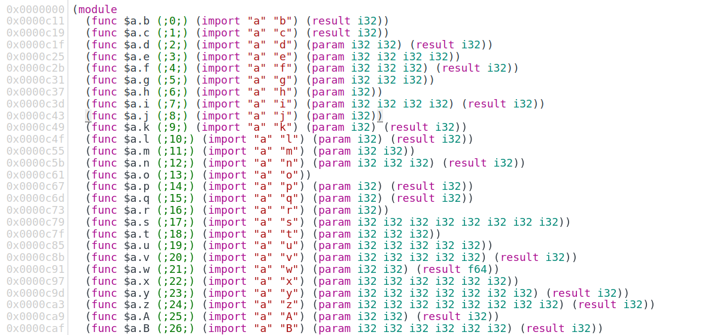

# Meet WebAssembly

## asm.js

asm.js 是 Mozilla 在2013年提出的一个基于 JavaScript 的语法标准，属于 JavaScript 的严格子集，其代码一般都是采用[转译器](https://en.wikipedia.org/wiki/Source-to-source_compiler)编译（例如基于 LLVM 的 Emscripten）将（C/C++）或其它语言转译而来。生成的 asm.js 文件变量都是静态类型，不用在运行时判断变量类型， 使得 JavaScript 引擎可以采用 AOT(Ahead Of Time) 的编译策略，也就是在运行前编译成机器码，因此运行速度会有一定提升。

asm.js 的目标并不是提高手写 JavaScript 代码的性能，也不实现增强性能以外的其他功能，通常是作为一种通过编译器生成的中间语言。

### 代码生成

例如这个C语言代码

```c
double add(double a, int b) {
    return a + b;
}
```

Emscripten 将输出下列 JavaScript 代码（已简化）：

```JavaScript
function add(a, b) {
  a = +a;
  b = b | 0;
  return +(a + +(b | 0));
}
```

实际上 asm.js 只提供两种数据类型：

1. *32位带符号整数*
2. *64位带符号浮点数*

对于其他类型都是以数值形式存在，保存在内存中，通过 TypedArray 调用。

asm.js 的变量类型声明有固定写法：

```JavaScript
function add(a, b) {
    a = +a; // a 是32位整数
    b = b | 0; // b 是64位浮点数
    return +(a + +(b | 0)); // 返回64位浮点数
}
```

asm.js 可以根据这种标记确定变量类型，不需要进行类型推断，浏览器可以根据这些标记进行激进的JIT优化，甚至 AOT 编译， 大幅提升性能。

### asm.js 带来了这些优点

- asm.js 作为一个 JavaScript 子集，完全兼容 JavaScript 语法，所有支持JavaScript的浏览器都可以运行 asm.js 代码
- asm.js 有着更高效的运行速度，
- asm.js 不是用于提高手写 JavaScript 的性能，而是由其他语言转译过来的中间语言，这让众多编程语言可以将现有的应用编译成 asm.js, 运行在浏览器中。

### 当然，它也有缺点

1. 类型提示让文件体积变得非常大
2. 代码编写仍然受 JavaScript 语法限制，如果要新增功能，将不得不修改 JavaScript 语言本身；
3. asm.js 文件还是一个 JavaScript 文件，所以它仍然需要被 JavaScript 引擎解析，生成中间代码，这两步是 JavaScript 代码在引擎执行过程中消耗时间最多的两部。特别是在移动设备上会减慢加载速度和比较耗电。
4. 它只是一个由厂商推出的，缺少一个统一的标准。

## MVP

浏览器厂商在研究如何改进 asm.js 时提出的一个 WebAssembly 前身: MVP，它不仅具有 asm.js 的优点，同时也解决了 asm.js 的缺点。
从 2017 年开始，四大浏览器厂商都开始支持 MVP， 即 WebAssembly。

### MVP 解决了哪些问题？

1. WebAssembly 代码可以从一开始就被编译成机器代码，从而实现性能改进；
2. 当代码被编译成WebAssembly时，生成的字节码以二进制格式表示，而不是文本格式，这样可以减晓文件大小，从而快速传输和下载；
3. 二进制文件的设计方式使得模块验证可以一次性完成，并且该文件解构还允许并行编译文件的不同部分；
4. 能够在浏览器中运行 JavaScript 以外的语言，让开发技术和运行时技术解耦，极大促进代码复用；
5. 由于不依赖于 JavaScript， 因此可以轻松地对技术进行改造，这种独立性能够更快地改进 WebAssembly。

>
> *流式编译*： 指浏览器下载和接收文件时将 WebAssembly 代码编译成机器代码的过程， 流式编译允许 WebAssembly 模块在完成下载后立即初始化，这大大加快了启动时间。
>

## WebAssembly 模块结构

WebAssembly 目前支持四种数据类型：

- 32位整数
- 64位整数
- 32位浮点数
- 64位浮点数

布尔值则使用32位整数表示，0表示`false`，非0表示`true`。其他类型，包括字符串都需要在模块的线性内存中表示。

WebAssembly 程序（二进制版本和浏览器中的编译版本）主要单元被称为*模块*，下图是一个 WebAssembly 文件的基本结构：

[WebAssembly 文件基本结构](../assets/webassembly-file-structure.drawio ':include :type=code')

[//]: # (![WebAssembly 文件基本结构]&#40;../assets/WebAssembly-file-structure.png&#41;)

### 前导

Wasm 二进制文件以 前导(Preamble) 开头， 前导包含一个魔数（`0x00 0x61 0x73 0x6D`, 即`\0asm`）, 用于区分 WebAssembly 模块和 ES6 模块，这个魔数之后是一个版本号（`0x01 0x00 0x00 0x00`, 即 `1`）,它指明了创建本文件时使用的WebAssembly二进制格式的版本。

在前导之后就是模块的主体内容，这些内容被分门别类放在不同段（Section）中。每个段都是可选的，因此严格来说可以存在没有任何段的控模块。
段分为两种： 已知段(Known Sections) 和 自定义段(Custom Sections)。

### 已知段

已知段只能存包含一个，并且必须以特定的顺序出现，每个分区都有特定用途，定义明确，并且在模块实例化时被校验。

### 自定义段

自定义段提供了一种在模块内包含数据的方法，用于不适用 已知段的用途。自定义段可以在模块中的任何位置（在已知段之前、中间或之后）出现任意次数, 并且允许多个 自定义段重名。

自定义段和 已知段不同的是，如果 自定义段内容错误，则不会触发校验错误。框架还可以延迟加载自定义部分，这表示他们包含的数据可能要到模块初始化后的某个时间点才可用。

## WebAssembly 文本格式

为了让人类可以阅读和编辑 WebAssembly， WebAssembly 二进制格式提供了相应的文本表示。这是一种用来在文本编辑器、浏览器开发者工具等工具中显示的中间形式。

### S-表达式

不论是二进制还是文本格式，WebAssembly代码中的基本单元是一个模块。在文本格式中，一个模块被表示为一个大的S-表达式。

S-表达式是一个非常古老和非常简单的用来表示树的文本格式。因此，我们可以把一个模块想象为一棵由描述了模块结构和代码的节点组成的树。不过，与一门编程语言的抽象语法树不同的是，WebAssembly的树是相当平的，也就是大部分包含了指令列表。

如果我们在浏览器开发者工具查看 WebAssembly 源码时，开发者工具会使用 WebAssembly 文本格式展示源码：



另外，如果一个空 WebAssembly 只包含前导数据（即：魔数（`0061 736d`）和版本号（`0100 0000`）），使用开发者工具查看源码时可以看到一个空模块：

```wasm
(module)
```

## WebAssembly 安全性

WebAssembly 是第一个共享 JavaScript VM 的语言，而它在运行时是沙箱化的，在这个沙箱中，除了初始化程序时提供给它的 ArrayBuffer (WebAssembly 将此 ArrayBuffer 用作线性内存， WebAssembly 会检查以确保代码在这个线性内存上运行)，而无法访问主机的内存和数据。
在 C++ 中，执行堆栈和线性内存一起位于内存中，尽管 C++ 代码不应该修改执行堆栈，但可以使用指针来这么做。WebAssembly 的执行堆栈与线性内存是分开的，代码无法访问。
另外， WebAssembly 也遵守和 JavaScript 相同的安全策略，包括 同源策略 等。

## 哪些语言支持转译为 WebAssembly

- C 和 C++。
- Rust 的目标是成为 WebAssembly 的首选编程语言。
- AssemblyScript 是一个新的编译器，它采用 TypeScript 并将其转换为 WebAssembly。转换 TypeScript 是有意义的，考虑到它是类型化的并且已经转译为 JavaScript。
- TeaVM 是一种将 Java 转换为 JavaScript 的工具，但现在也可以生成 WebAssembly。
- Go 1.11 向 WebAssembly 添加了一个实验性端口，其中包括一个垃圾收集器作为已编译 WebAssembly 模块的一部分。
- Pyodide 是 Python 的一个端口，其中包括 Python 科学堆栈的核心包：Numpy、Pandas 和 matplotlib。
- Blazor 是 Microsoft 将 C# 引入 WebAssembly 的一项实验性工作。

这个 [Github 仓库](https://github.com/appcypher/awesome-wasm-langs) 维护了一个可以编译为 WebAssembly 或将其 VM 放入在 WebAssembly 中的语言列表，并且指出每个语言支持程度。

## 使用场合

2017 年开始，所有现代浏览器厂商都发布了支持 WebAssembly MVP 的浏览器版本， 包括： Chrome, Edge, Firefox, Opera 和 Safari。
一些移动 Web 浏览器也支持 WebAssembly, 包括 Chrome, Firefox for Android 和 Safari。

WebAssembly 在设计时就考虑了移植性，因此它可以用于多个场合，而不仅限于浏览器。可以参考这篇关于 [WASI](https://hacks.mozilla.org/2019/03/standardizing-wasi-a-WebAssembly-system-interface/) （WebAssembly Standard Interface）新标准的文章， 这个标准接口用于确保 WebAssembly 模块可以在所有受支持系统上保持一致性。

## 引用

1. [Emscripten 安装](https://emscripten.org/docs/getting_started/downloads.html)
1. [WebAssembly](https://WebAssembly.org/)
1. [Why marketers should care about mobile page speed](https://www.thinkwithgoogle.com/marketing-strategies/app-and-mobile/mobile-page-speed-load-time/)
1. [理解WebAssembly文本格式](https://developer.mozilla.org/zh-CN/docs/WebAssembly/Understanding_the_text_format)
