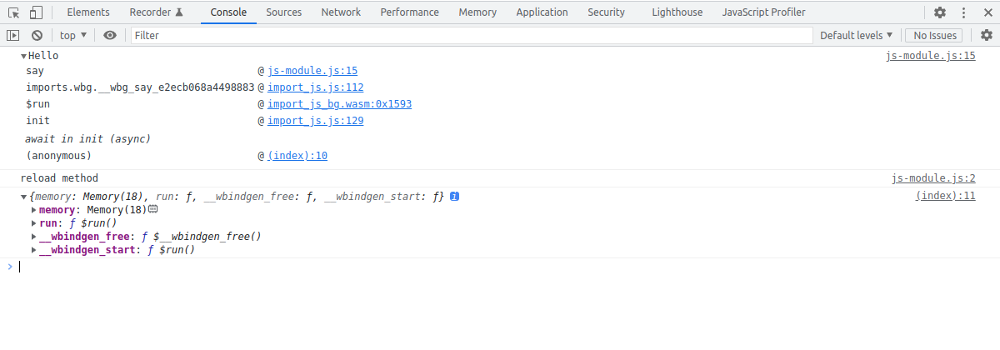

# WebAssembly 模块与 JavaScript 互操作（Rust语言）

## JavaScript 调用 Rust 函数

在使用 rust 创建 WebAssembly 模块前，先安装工具：

```bash
cargo install wasm-pack
```

创建项目

```bash
cargo new --lib hello-wasm
```

`Cargo.toml`:

```toml
[package]
name = "hello-wasm"
version = "0.1.0"
edition = "2021"

[lib]
crate-type = ["cdylib"]

[dependencies]
wasm-bindgen = "0.2.80"
```

`src/lib.rs`

```rust
use wasm_bindgen::prelude::*;

// 导出 add 函数
#[wasm_bindgen]
pub fn add(a: f64, b: f64) -> f64 {
    a + b
}
```

编译代码：

```bash
wasm-pack build --target nodejs
```

在 JavaScript 中使用:

```js
const rust = import('./pkg/hello.js');

rust
    .then(m => m.add(100, 100))
    .then(result => console.log(result));
```

运行 `node ./index.js` 将顺利输出 200。

## Rust 调用 JavaScript

[//]: # (`#[wasm_bindgen]` 宏可以加到 `extern "C" {}` 上来导入 JavaScript 中的函数。 这也是 `js-sys` 和 `web-sys` 这两个库的原理。)

首先，我们先创建一个 js 文件， js 文件使用 `export` 语句导出方法和类型：

```js
// js-module.js
export function reload() {
    console.log('reload method')
}
export class User {
    constructor(id) {
        this._id = id;
    }
    get id() {
        return this._id;
    }
    set id(i) {
        this._id = i;
    }
    say() {
        console.trace('Hello')
    }
}
```

然后在 Rust 中引用 js 文件：

```rust
use wasm_bindgen::prelude::*;

#[wasm_bindgen(module = "/js-module.js")]
extern "C" {
    
}
```

映射

```rust
use wasm_bindgen::prelude::*;

#[wasm_bindgen(module = "/js-module.js")]
extern "C" {
    fn reload() -> JsValue;

    type User; // class User

    #[wasm_bindgen(constructor)]
    fn new(id: String) -> User;

    #[wasm_bindgen(method, getter)]
    fn id(this: &User) -> String;

    #[wasm_bindgen(method, setter)]
    fn set_id(this: &User, id: String) -> User;

    #[wasm_bindgen(method)]
    fn say(this: &User);
}

#[wasm_bindgen(start)]
pub fn run() {
    let u = User::new(String::from("456789"));
    u.set_id(String::from("123asd"));
    u.say();
    reload();
}
```

编译：

```bash
wasm-pack build --target web
```

HTML 页面：

```html
<script type="module">
    import init from './pkg/import_js.js';
    init().then(mod => {
        console.log(mod);
    })
</script>
```

控制台输出：



## JavaScript 如何与 Rust 交换数据
